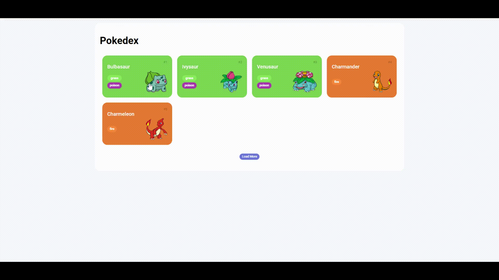

# Trilha JS Developer - Pokedex

## Aplicando Modal de Detalhamento no Projeto Pokedex

### Conforme foi solicitado no desafio, apliquei uma solução para que fosse ativado um Dialog com detalhes do Pokemon quando o usuário clicasse sobre ele.

&nbsp;
&nbsp;

